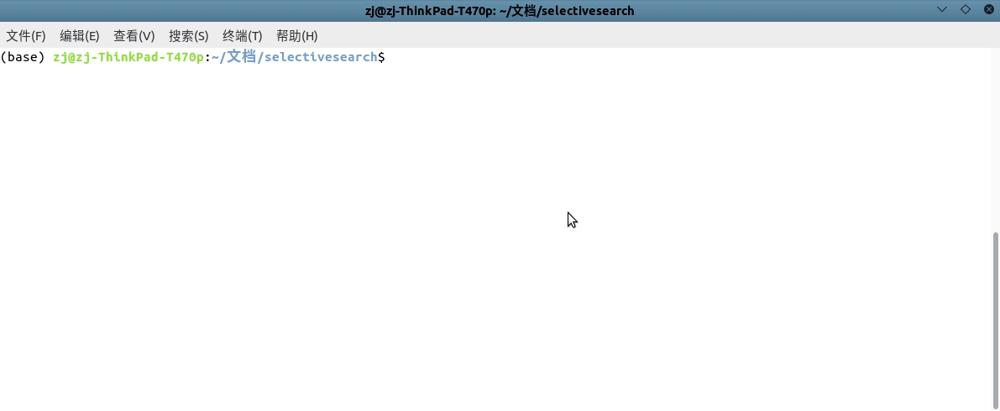

# selectivesearch

[](https://selectivesearch.readthedocs.io/zh_CN/latest/?badge=latest) [](https://github.com/RichardLitt/standard-readme) [](https://conventionalcommits.org) [](http://commitizen.github.io/cz-cli/)

> selectivesearch算法实现

`OpenCV`实现了论文[Selective Search for Object Recognition](http://xueshu.baidu.com/usercenter/paper/show?paperid=b689fcf3ed998dfbb4213687367b6175&site=xueshu_se)提供的选择性搜索算法。当前仓库将整个工程进行重构，以便进一步的学习和使用

*当前在`Ubuntu 18.04`下使用`OpenCV 4.2.0`*

## 内容列表

- [背景](#背景)
- [安装](#安装)
- [用法](#用法)
- [主要维护人员](#主要维护人员)
- [致谢](#致谢)
- [参与贡献方式](#参与贡献方式)
- [许可证](#许可证)

## 背景

选择性搜索算法是`R-CNN`算法的一部分。仓库[ AlpacaDB /selectivesearch](https://github.com/AlpacaDB/selectivesearch)实现了`python`版本；同时`OpenCV`也提供了选择性搜索算法的`C++`源码，不过里面封装的比较好，其源文件中包含了多个类定义和函数实现。为了更方便的学习选择性搜索算法，我将其实现进行了重构

## 安装

### 本地编译文档

```
$ pip install -r requirements.txt
```

### 本地编译程序

需要预先安装以下工具：

```
# Ubuntu 18.04
$ sudo apt install gcc g++ make cmake 
```

## 用法

### 文档浏览

有两种使用方式

1. 在线浏览文档：[selectivesearch](https://selectivesearch.readthedocs.io/zh_CN/latest/?badge=latest)

2. 本地浏览文档，实现如下：

    ```
    $ git clone https://github.com/zjZSTU/selectivesearch.git
    $ cd selectivesearch
    $ mkdocs serve
    ```
    启动本地服务器后即可登录浏览器`localhost:8000`

### 编译程序

编译如下：

```
$ cd cplusplus
$ cmake -S . -B cmake-build
$ cd cmake-build/
$ make
```

测试如下：

```
$ ./selectivesearch ../../imgs/000262.jpg q
```



## 主要维护人员

* zhujian - *Initial work* - [zjZSTU](https://github.com/zjZSTU)

## 致谢

### 引用

```
@article{UijlingsSelective,
  title={Selective Search for Object Recognition},
  author={Uijlings, J. R. R. and K. E. A. van de Sande…},
  journal={International Journal of Computer Vision},
  volume={104},
  number={2},
  pages={154-171},
}
```

## 参与贡献方式

欢迎任何人的参与！打开[issue](https://github.com/zjZSTU/selectivesearch/issues)或提交合并请求。

注意:

* `GIT`提交，请遵守[Conventional Commits](https://www.conventionalcommits.org/en/v1.0.0-beta.4/)规范
* 语义版本化，请遵守[Semantic Versioning 2.0.0](https://semver.org)规范
* `README`编写，请遵守[standard-readme](https://github.com/RichardLitt/standard-readme)规范

## 许可证

[Apache License 2.0](LICENSE) © 2020 zjZSTU
