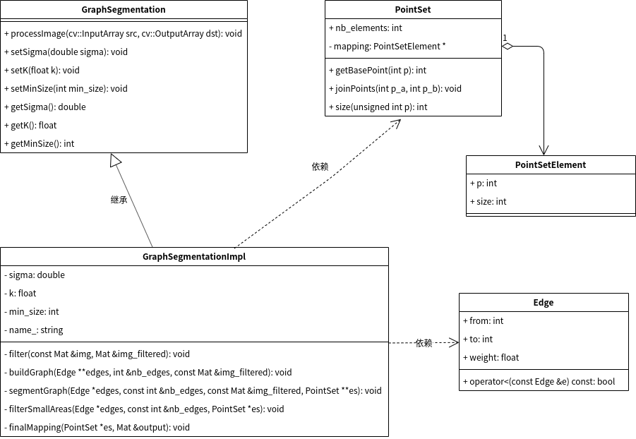

# 图分割-源码解析

## 工程结构

包含`3`个文件夹：

1. `include`：头文件
2. `samples`：测试程序
3. `src`：源文件

```
├── include
│   ├── edge.h
│   ├── graphsegmentation.h
│   ├── graphsegmentationimpl.h
│   ├── point_set_element.h
│   ├── point_set.h
│   └── segmentation.h
├── samples
│   ├── graphsegmentation_custom.cpp
│   ├── opencv
│   │   ├── graphsegmentation_demo.cpp
└── src
    ├── graphsegmentation.cpp
    ├── graphsegmentationimpl.cpp
    └── point_set.cpp
```

## 类图



* 类`GraphSegmentation`声明了图分割算法的公共函数
* 类`GraphSegmentationImpl`定义了图分割算法的具体实现
* 类`Edge`表示无向边
* 类`PointSetElement`表示并查集元素
* 类`PointSet`实现并查集操作

## 超参数

1. $\alpha$：作用于高斯滤波，表示离散程度，值越大，滤波效果越明显
2. $k$：用于计算阈值函数τ，控制两个分量之间的差异必须大于其内部差异的程度。值越大，表示分量间差异必须更大，最后得到的结果中会产生更大的分量（区域）。小图像的k值小，大图像的k值大；k值就越小越精细
3. $min_size$：