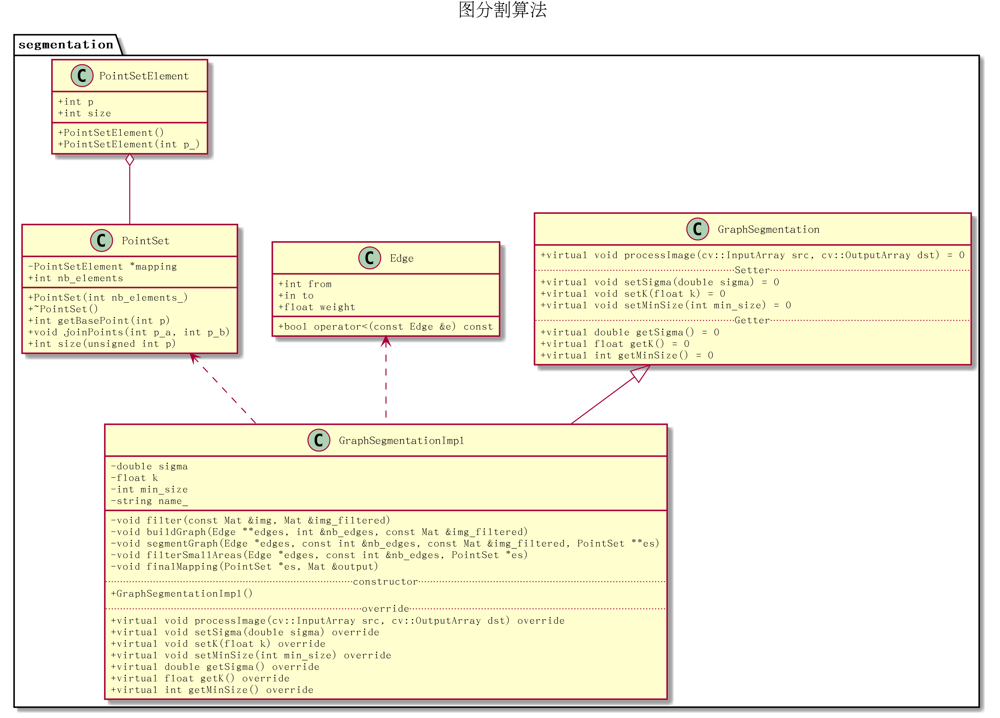

# 图分割-源码解析

## 工程结构

包含`3`个文件夹：

1. `include`：头文件
2. `samples`：测试程序
3. `src`：源文件

```
├── include
│   ├── graphsegment
│   │   ├── edge.h
│   │   ├── graphsegmentation.h
│   │   ├── graphsegmentationimpl.h
│   │   ├── point_set_element.h
│   │   └── point_set.h
│   └── segmentation.h
├── samples
│   ├── graphsegmentation_custom.cpp
│   ├── opencv
│   │   ├── graphsegmentation_demo.cpp
└── src
    ├── graphsegmentation.cpp
    ├── graphsegmentationimpl.cpp
    └── point_set.cpp
```

## 类图



* 类`GraphSegmentation`声明了图分割算法的公共函数
* 类`GraphSegmentationImpl`定义了图分割算法的具体实现
* 类`Edge`表示无向边
* 类`PointSetElement`表示并查集元素
* 类`PointSet`实现并查集操作

## 超参数

1. $\alpha$：作用于高斯滤波，表示离散程度，值越大，滤波效果越明显
2. $k$：用于计算阈值函数τ，控制两个分量之间的差异必须大于其内部差异的程度。值越大，表示分量间差异必须更大，最后得到的结果中会产生更大的分量（区域）。小图像的`k`值小，大图像的`k`值大；`k`值越小越精细
3. `min_size`：设置最小分量大小

## 函数流程

`main`函数分`3`步实现

1. 创建图分割对象，设置超参数。主要函数是`createGraphSegmentation`
2. 进行图分割操作，获取结果图像。主要函数是`processImage`
3. 对结果图像上色，得到分割结果。主要函数是`color_mapping`

### createGraphSegmentation

位于`graphsegmentation.cpp`，是一个辅助函数，用于创建`GraphSegmentation`对象，并设置初始参数

### processImage

函数`processImage`实现了图分割操作，分`6`步实现


*注意：在高斯滤波前需要转换图像精度，从`uint8 -> 32F`*

最后得到的结果图像中，同一分量的像素点的值相同

### color_mapping

由于结果图像的取值过小（比如共`32`个分量，那么取值为`0-31`），所以进行颜色转换，从`HSV -> RGB`，添加更丰富的颜色信息