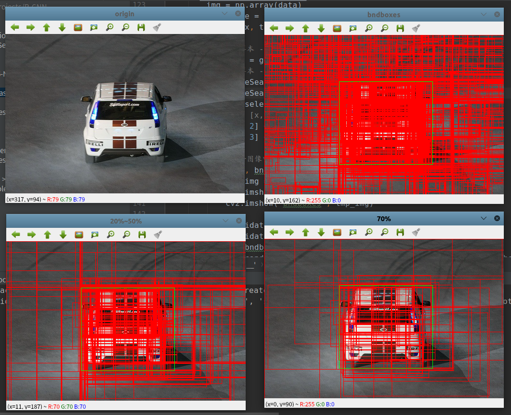

# 数据集制作

使用[PASCAL VOC 2007](http://host.robots.ox.ac.uk/pascal/VOC/voc2007/index.html)进行数据处理，分为两个阶段：

* 初始训练阶段
    * 正样本：图像标注数据
    * 负样本：使用`selectivesearch`算法得到的候选区域，并符合以下条件：
        1. 与正样本重叠率在`[20%, 50%]`
        2. 负样本之间的重叠率不超过`70%`
        3. 随机舍弃一半的汽车（`car`）、猫（`cat`）、狗（`dog`）和人（`person`）的负样本
* 再训练阶段：
    * 将训练后的模型应用于训练集，迭代添加检测失败并满足上述条件的负样本

## 初始训练阶段

文件地址：`create_inital_dataset.py`

使用`VOC 2007`训练集，创建初始训练集（注意：最后保存正/负样本的边界框坐标），操作如下：

1. 遍历所有图像和标注数据
   1. 提取标注数据（正样本），按指定类别进行保存（比如，保存到`cat/positive/000232.csv`）
   2. 使用`0selectivesearch`算法检索区域建议
      1. 针对每个正样本边界框，过滤不符合条件的区域建议，最后将负样本保存按指定类别保存（比如，保存到`cat/negative/000232.csv`）

区域建议经过条件过滤后，能够大大减少最后的负样本数目，以`000012.jpg`为例，实现结果如下：

