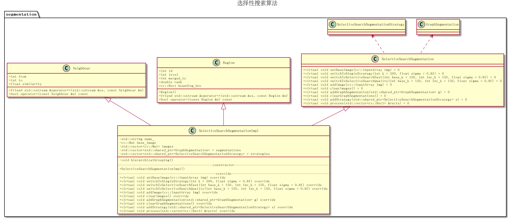
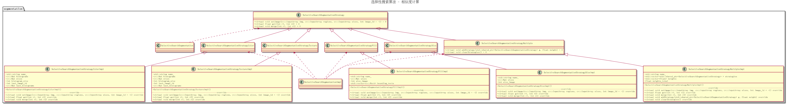

# 选择性搜索-源码解析

## 工程结构

1. 头文件
      1. `include/segmentation.h`：头文件入口
      2. `include/graphsegment/`：图分割算法头文件
      3. `include/selectivesearch/`：选择性搜索算法头文件
2. 源文件：`src`文件夹
3. 测试文件：`samples/selectivesearchsegmentation_custom.cpp`

```
├── CMakeLists.txt
├── include
│   ├── graphsegment
│   │   ├── edge.h
│   │   ├── graphsegmentation.h
│   │   ├── graphsegmentationimpl.h
│   │   ├── point_set_element.h
│   │   └── point_set.h
│   ├── segmentation.h
│   └── selectivesearch
│       ├── neighbor.h
│       ├── rect_comparator.h
│       ├── region.h
│       ├── selectivesearchsegmentation.h
│       ├── selectivesearchsegmentationimpl.h
│       ├── selective_search_segmentation_strategy_color.h
│       ├── selective_search_segmentation_strategy_color_impl.h
│       ├── selective_search_segmentation_strategy_fill.h
│       ├── selective_search_segmentation_strategy_fill_impl.h
│       ├── selective_search_segmentation_strategy.h
│       ├── selective_search_segmentation_strategy_multiple.h
│       ├── selective_search_segmentation_strategy_multiple_impl.h
│       ├── selective_search_segmentation_strategy_size.h
│       ├── selective_search_segmentation_strategy_size_impl.h
│       ├── selective_search_segmentation_strategy_texture.h
│       └── selective_search_segmentation_strategy_texture_impl.h
├── samples
│   └── selectivesearchsegmentation_custom.cpp
└── src
    ├── graphsegmentation.cpp
    ├── graphsegmentationimpl.cpp
    ├── neighbor.cpp
    ├── point_set.cpp
    ├── region.cpp
    ├── selectivesearchsegmentation.cpp
    ├── selectivesearchsegmentationimpl.cpp
    ├── selective_search_segmentation_strategy_color.cpp
    ├── selective_search_segmentation_strategy_color_impl.cpp
    ├── selective_search_segmentation_strategy_fill.cpp
    ├── selective_search_segmentation_strategy_fill_impl.cpp
    ├── selective_search_segmentation_strategy_multiple.cpp
    ├── selective_search_segmentation_strategy_multiple_impl.cpp
    ├── selective_search_segmentation_strategy_size.cpp
    ├── selective_search_segmentation_strategy_size_impl.cpp
    ├── selective_search_segmentation_strategy_texture.cpp
    └── selective_search_segmentation_strategy_texture_impl.cpp
```

## 类图

分两部分实现，首先是选择性搜索算法的全局类图，其次是选择性搜索算法的相似度计算策略



* 类`SelectiveSearchSegmentation`声明了选择性搜索算法的公共函数
* 类`SelectiveSearchSegmentationImpl`定义了选择性搜索算法的具体实现
* 类`GraphSegmentation`声明了图分割算法的公共函数
* 类`SelectiveSearchSegmentationStrategy`声明了相似度度量策略的公共函数
* 类`Region`实现了并查集，作用于区域合并
* 类`Neighbor`定义了边



* 类`SelectiveSearchSegmentationStrategy`声明了相似度度量策略的公共函数
* 类`SelectiveSearchSegmentationStrategyColorImpl`定义了基于颜色特征的相似性度量
* 类`SelectiveSearchSegmentationStrategyTextureImpl`定义了基于纹理特征的相似性度量
* 类`SelectiveSearchSegmentationStrategySizeImpl`定义了基于区域大小的相似性度量
* 类`SelectiveSearchSegmentationStrategySizeImpl`定义了基于区域形状的相似性度量
* 类`SelectiveSearchSegmentationStrategyMultiple`声明了组合多个相似性度量策略的公共函数
* 类`SelectiveSearchSegmentationStrategyMultipleImpl`定义了基于多特征的相似性度量计算

## 超参数

图分割相关：

* $k$：用于计算阈值函数τ，控制两个分量之间的差异必须大于其内部差异的程度
* $\sigma$：作用于高斯滤波

## 函数流程

根据测试代码`samples/selectivesearchsegmentation.cpp`，总体函数流程图如下所示

1. 创建选择性搜索对象，输入原始图像，设置检测策略
2. 处理图像，获取候选区域
3. 绘制候选区域边框

### 第一步：预处理

分为`3`个步骤：

1. 创建选择性搜索对象，使用函数`createSelectiveSearchSegmentation`
2. 输入原始图像，使用函数`setBaseImage`
3. 设置检测策略

#### 创建选择性搜索对象

`createSelectiveSearchSegmentation`是一个辅助性函数，用于创建`SelectiveSearchSegmentation`对象，其返回一个`SelectiveSearchSegmentation`指针

#### 输入原始图像

通过调用类`SelectiveSearchSegmentation`的公共函数`setBaseImage`载入原始图像

#### 设置检测策略

类`SelectiveSearchSegmentation`提供了`3`种检测策略：

1. 简单计算策略`switchToSingleStrategy`
2. 快速计算策略`switchToSelectiveSearchFast`
3. 高质量计算策略`switchToSelectiveSearchQuality`

##### 简单计算策略

函数`switchToSingleStrategy`仅使用单个分组

* 颜色空间：`HSV`
* 图分割超参数：`k=200，sigma=0.8`
* 相似性度量：`0.25*color + 0.25*texture + 0.25*size + 0.25*size`

##### 快速分组策略

函数`switchToSelectiveSearchFast`使用多个分组

* 颜色空间：`HSV、Lab`（共`2`种）
* 图分割超参数：`base_k = 150，inc_k = 150，sigma = 0.8`（在程序中最高`k`值设置为`base_k + inc_k * 2`，所以`k`取值为`150/300/450`，共`3`种）
* 相似性度量：`0.25*color + 0.25*texture + 0.25*size + 0.25*fill`、`0.3333*fill + 0.3333*texture + 0.3333*size`（共`2`种）

所以快速计算策略使用了`2*3*2=12`个分组

##### 高质量计算策略

函数`switchToSelectiveSearchQuality`使用了更多的分组

* 颜色空间：`HSV、Lab、I、H、bgI`（共`5`种）
* 图分割超参数：`base_k = 150，inc_k = 150，sigma = 0.8`（在程序中最高`k`值设置为`base_k + inc_k * 2`，所以`k`取值为`150/300/450`，共`3`种）
* 相似性度量：`0.25*color + 0.25*texture + 0.25*size + 0.25*fill、0.3333*fill + 0.3333*texture + 0.3333*size、fill、size`（共`4`种）

所以高质量计算策略使用了`5*3*4=60`个分组

### 第二步：区域检测

在预处理阶段设置了多个分组策略，