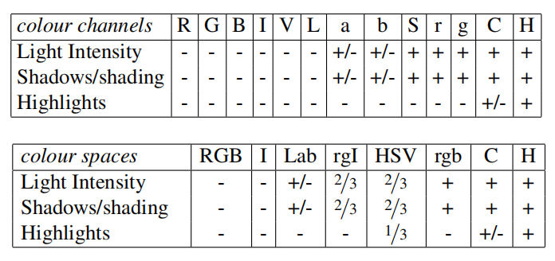
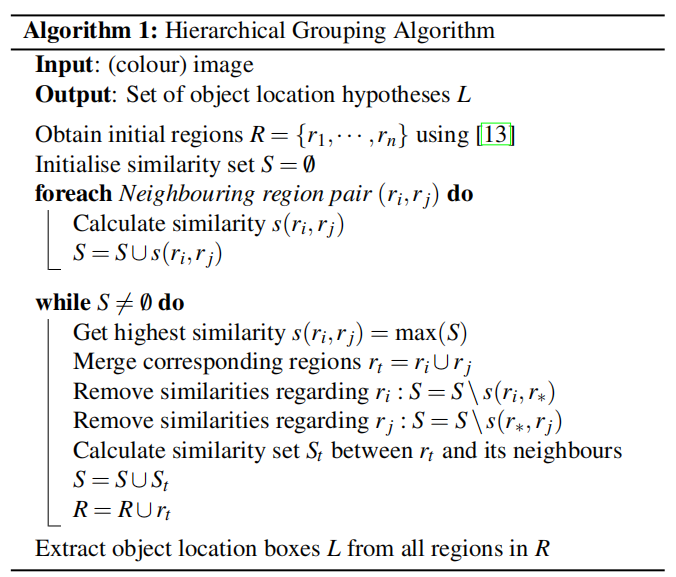

# 选择性搜索-算法解析

## 参考

[[译]作用于目标识别的选择性搜索](https://blog.zhujian.life/posts/1cb6a408.html)

[[译]Selective Search for Object Detection (C++/Python)](https://blog.zhujian.life/posts/815ea453.html)

## 滑动窗口算法 vs 区域建议算法

* 传统的滑动窗口（`sliding window`）算法需要对图像进行穷举搜索，比较适合于固定长宽比的目标检测，通过使用规则网格、固定比例和固定纵横比来减少搜索空间
  
* 区域建议（`region proposal`）算法通过分割方法来获取候选区域，在分割过程中根据颜色、纹理等准则组合彼此相似的相邻区域。和滑动窗口算法相比，其能够得到任意尺度和任意位置的对象，并且最后的候选区域数少很多倍

选择性搜索（`selective serach`）算法就是一种区域建议算法

## 原理解析

选择性搜索算法是一个目标检测算法，通过图分割算法得到初始分割区域，然后利用分层分组算法组合更多的候选区域，最终得到一组过完备的候选区域

### 分层分组算法

分层分组算法（`hierarchical grouping algorithm`）是选择性搜索算法的核心，其实现操作如下：

1. 通过图分割算法得到一组初始分割集
2. 利用贪心算法对候选区域进行迭代分组
      1. 计算所有相邻区域的相似度
      2. 每次组合相似度最高的相邻区域对
      3. 重复第一个步骤，直到所有区域组合成一个区域（整个图像）

分层分组算法是一个自底向上的分割方法，每次分组都能得到一个新的区域，而这个区域是通过组合相似度最高的相邻区域对得到的（分层）。所以最后得到候选区域集能够在所有尺度上生成目标，满足捕获所有尺度的条件

### 相似性度量

在分层分组算法中，每次分组操作都需要度量所有相邻区域对的相似度。论文定义了四个互补的、快速计算相似度的度量，并且这些测量值都在`[0,1`]范围内，有助于这些测量值的组合

1. 颜色相似度
2. 纹理相似度
3. 大小相似度
4. 形状相似度

#### 颜色相似度

##### 定义

为图像的每个通道计算`25`个`bin`的颜色直方图，并将所有通道的直方图连接起来，以获得`25×3＝75`维的颜色描述符

##### 计算

彩色直方图使用$L1$归一化。相似性通过直方图相交来测量：

$$
S_{colour}(r_{i}, r_{j})=\sum_{k=1}^{n} \min(c_{i}^{k}, c_{j}^{k})
$$

* $r_{i}$表示第$i$个区域
* $c^{k}_{i}$表示第$i$个颜色描述符中第$k$个$bin$的直方图值

##### 合并

合并两个区域后，其颜色相似度可通过以下方式计算

$$
C_{t}=\frac{size(r_{i})\times C_{i} + size(r_{j})\times C_{j}}{size(r_{i}) + size(r_{j})}
$$

#### 纹理相似度

##### 定义

纹理特征是通过提取每个通道`8`个方向上的高斯导数来计算的。对于每个方向和每个颜色通道，计算`10`个`bin`的直方图，得到`10x8x3=240`维特征描述符

##### 计算

纹理直方图使用$L1$进行归一化。相似性通过直方图相交来测量：

$$
S_{texture}(r_{i}, r_{j}) = \sum_{k=1}^{n} \min (t_{i}^{k}, t_{j}^{k})
$$

* $r_{i}$表示第$i$个区域
* $t^{k}_{i}$表示第$i$个纹理描述符中第$k$个$bin$的直方图值

##### 合并

纹理相似度在合并区域后的计算和颜色相似度一样

$$
T_{t}=\frac{size(r_{i})\times T_{i} + size(r_{j})\times T_{j}}{size(r_{i}) + size(r_{j})}
$$

#### 大小相似度

##### 定义

大小相似度$S_{size}(r_{i}, r_{j})$用于鼓励小区域尽早合并，防止单个区域一个接一个的吞食相邻区域。$S_{size}(r_{i}, r_{j})$定义为$r_{i}$和$r_{j}$共同占用的图像比率

##### 计算

$$
S_{size}(r_{i}, r_{j})=1 - \frac{size(r_{i}) + size(r_{j})}{size(im)}
$$

* $size_{i}$表示第$i$个区域的像素点个数
* $size(im)$表示整个图像的大小

#### 形状相似度

##### 定义

$S_{fill}(r_{i},r_{j})$用于测量区域$r_{i}$和$r_{j}$的匹配程度。理想情况下是两个区域能够填补相互的空白：如果$r_{i}$包含在$r_{j}$中，那么首先合并这两个区域以避免大的空白出现是合乎逻辑的；如果$r_{i}$和$r_{j}$几乎不接触在一起，那么他们将形成一个奇怪的区域，不应该被合并

##### 计算

将$BB_{ij}$定义为$r_{i}$和$r_{j}$周围的紧边界框。现在$S_{fill}(r_{i},r_{j})$表示$BB_{ij}$中没有被$r_{i}$和$r_{j}$所覆盖的区域占整个图像的比例：

$$
fill(r_{i},r_{j})=1 - \frac {size(BB_{ij})-size(r_{i})-size(r_{j})}{size(im)}
$$

#### 相似度组合

两个区域之间的最终相似度定义为上述`4`个相似度的线性组合

$$
s(r_{i},r_{j})=a_{1}s_{colour}(r_{i},r_{j})+a_{2}s_{texture}(r_{i},r_{j})+a_{d}s_{size}(r_{i},r_{j})+a_{r}s_{fill}(r_{i},r_{j})
$$

其中$a_{i}$取值为$0$或者$1$，表明是否使用此项相似度度量。由于我们的目标是使我们的采样多样化，我们不考虑任何加权相似性

## 算法解析

### 流程

大体分`3`部分：

1. 使用图分割算法得到初始分割集
2. 使用分层分组算法进一步组合区域，得到分层分割集
3. 组合所有分层分割集，得到最终的候选目标

#### 创建初始分割集

为了得到尽可能多的初始分割集，通过不同的颜色空间和改变图分割算法超参数来完成

##### 颜色空间

考虑不同的场景和照明条件，选择性搜索算法在多个颜色空间中进行后续的图分割和分层分组操作

1. `RGB`
2. 强度`I`
3. `Lab`
4. 归一化`RGB`的`rg`通道加上强度，表示为`rgI`
5. `HSV`
6. 归一化`RGB`，表示为`rgb`
7. 和强度相对的颜色空间，表示为`C`
8. `HSV`的色调通道`H`

##### 图分割算法

选择性搜索算法仅使用图分割算法进行初始分割集的创建，通过修改超参数$k$能够得到更多的初始分割集（$k$值越小，分割越细）

#### 创建分层分割集

分层分组算法实现如下：

* **算法1**：分层分组算法
* **输入**：（彩色）图像
* **输出**：一组目标定位假设$L$
* 使用论文[13]的方法获取初始区域$R={r_{1},...,r_{n}}$
* 初始化相似集$S=\varnothing $（空集）
* **foreach** 相邻区域对$(r_{i},r_{j})$ **do**
    - 计算相似度$s(r_{i},r_{j})$
    - $S = S \cup s(r_{i},r_{j})$（并集）
* **while** $S\neq \varnothing $ **do**
    - 获取最高相似度$s(r_{i},r_{j}) = max(S)$
    - 合并相应的区域$r_{t} = r_{i} \cup r_{j}$ 
    - 移除与$r_{i}$相关的相似度：$S = S\setminus s(r_{i},r_{\ast })$
    - 移除与$r_{j}$相关的相似度：$S = S\setminus s(r_{\ast },r_{j})$
    - 计算新区域$r_{t}$与周围区域的相似集$S_{t}$
    - $S = S \cup S_{t}$ （每次操作后相似集$S$都会减少，最后仅包含一个区域，就是整个图像） 
    - $R = R \cup r_{t}$（每次操作后区域集R均会增加，自底而上不断的组合可能的目标位置）
* 从$R$中的所有区域提取目标位置框$L$

#### 组合分割集

组合多个分组策略得到的假设集时，需要考虑两个问题：

1. 假设集在单独分组策略中的生成顺序过于强调大区域
2. 不同假设集之间有可能存在重复区域

针对第一个问题，通过随机性策略来防止这一情况。给定一个分组策略$j$，$r_{i}^{j}$表示在该分组分层计算中第$i$次创建的假设区域，其中$i=1$表示该次分层的顶部（其对应的区域覆盖整个图像）。现在将位置值$v_{i}^{j}$计算为$RND\times i$，其中$RND$是[0,1]范围内的随机数。最后的排名是通过对区域按$v_{i}^{j}$排序获得的

将所有打乱后的假设集组合在一起后，再过滤出排名较低的重复项，这样可以确保重复框有更好的机会获得高等级

### 优点

1. 捕获全尺度。对象可以在图像中以任何比例出现
2. 多元化。组合多个策略生成假设集
3. 快速计算